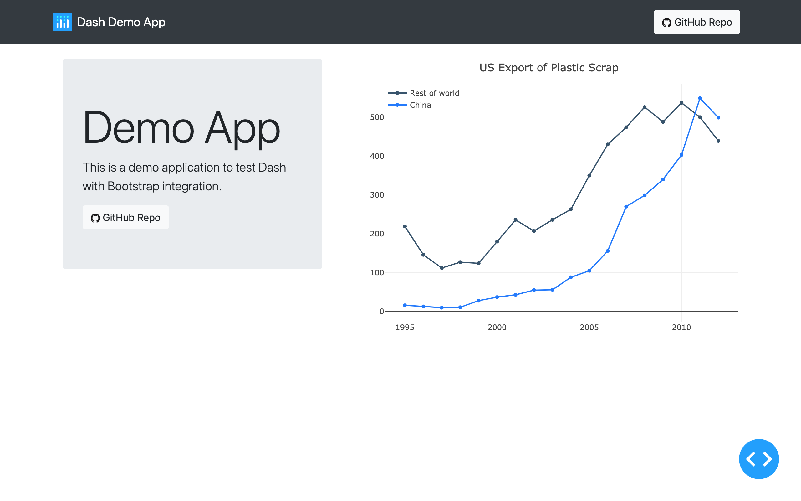

# Dash Demo App


This is a demo application to test Dash with Bootstrap integration.




## Setup

Simply install requirements:

```bash
$ pip install -r requirements.txt
```

And run the app:

```bash
$ python app.py
```

Now you can go to [http://127.0.0.1:8050/](http://127.0.0.1:8050/) to see the app in action.